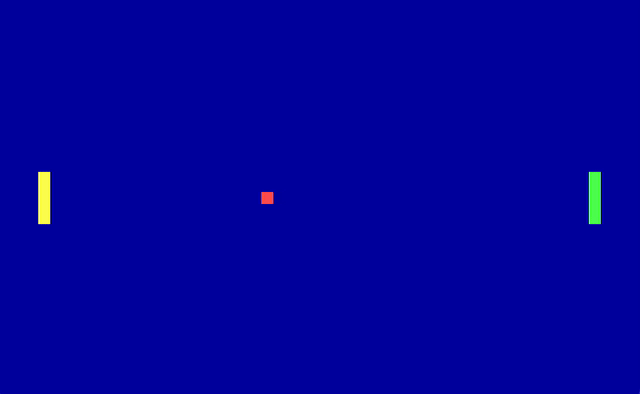

# Pongboot

Standalone pong clone squeezed into a 512 byte x86 bootloader. Use W and S to
move up and down.

## Building

Simply run `make` to build the bootloader. The only dependency is
[Nasm](https://www.nasm.us).

If you have [Qemu](https://www.qemu.org/) installed you can run the resulting
file with `make run`.

## License

Free software under the GNU GPLv3. See the included `COPYING` file for details.
Copyright [Ollie Etherington](https://www.etherington.xyz).
